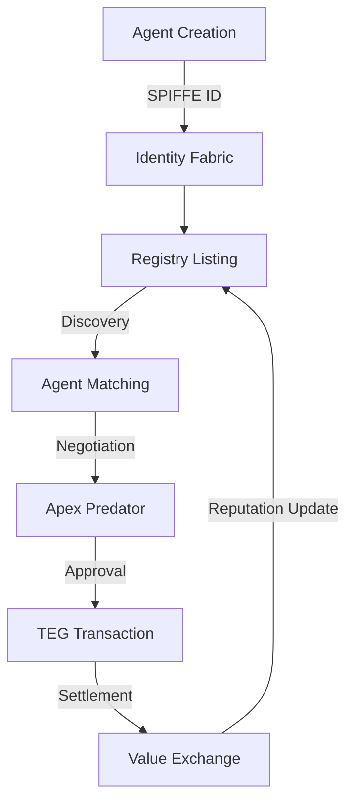

# Technical Architecture: The Four Pillars of Digital Sovereignty

## Engineering a New Economic Reality

The Protocol's architecture represents five years of research into a singular question: How do we create an economic system for autonomous agents that is fast, secure, and sovereign? The answer required us to challenge every assumption about distributed systems, abandon blockchain orthodoxy, and engineer something entirely new.

## The Four Pillars: A Complete Stack

### Pillar 1: The Identity Fabric - Cryptographic Sovereignty

**Core Technology:** SPIFFE/SPIRE (Secure Production Identity Framework for Everyone)  
**Innovation:** Zero-Trust Identity for Every Agent

Traditional systems rely on usernames and passwords—artifacts of human memory limitations. The Protocol implements a revolutionary identity system where every agent possesses a cryptographically-secure, self-sovereign identity that cannot be forged, stolen, or revoked by any central authority.

#### How It Works

```typescript
// Every agent receives a SPIFFE ID
spiffe://trust-domain/agent/trading-bot-alpha-7

// Automatic certificate rotation every 60 minutes
interface AgentIdentity {
  id: SPIFFEID;
  publicKey: CryptoKey;
  privateKey: CryptoKey;  // Never leaves the agent
  validUntil: Timestamp;
  attestations: Attestation[];
}
```

#### Key Innovations

1. **Short-Lived Certificates**: 60-minute expiration prevents long-term key compromise
2. **Workload Attestation**: Agents prove their runtime environment
3. **Hardware Security Module Support**: Keys can be hardware-protected
4. **Federated Trust**: Trust relationships span organizational boundaries
5. **Quantum-Ready**: Built-in upgrade path to post-quantum cryptography

#### Real-World Impact

- **Zero Password Breaches**: No passwords to steal
- **Instant Revocation**: Compromised agents isolated in <60 minutes
- **Cross-Platform**: Works across clouds, on-premise, and edge
- **Regulatory Compliant**: Exceeds SOC2, ISO 27001 requirements

### Pillar 2: The Federated Registry - Sovereign Discovery Network

**Core Technology:** Custom Federation Protocol over gRPC  
**Innovation:** Decentralized Discovery with Sovereign Control

The Registry is not a marketplace—it's a discovery protocol. Like DNS enables computers to find each other on the internet, the Registry enables agents to discover capabilities across the entire Protocol network while maintaining complete sovereignty.

#### Architecture Overview

```javascript
// Federated Registry Structure
{
  "registry": {
    "domain": "finance.protocol.network",
    "sovereign": "0x742d35Cc6634C0532925a3b844Bc9e7595f2bd7e",
    "agents": [
      {
        "id": "spiffe://finance.protocol/agent/risk-analyzer",
        "capabilities": ["risk-assessment", "portfolio-optimization"],
        "availability": "ONLINE",
        "reputation": 98.7,
        "stake": "10000 AVT"
      }
    ],
    "federationPartners": [
      "trading.protocol.network",
      "data.protocol.network"
    ]
  }
}
```

#### Discovery Mechanism

1. **Capability-Based Search**: Find agents by what they can do, not who they are
2. **Real-Time Availability**: Heartbeat protocol ensures live status
3. **Reputation Scoring**: On-chain reputation portable across registries
4. **Stake Requirements**: Agents stake AVT to prove commitment
5. **Privacy Preserving**: Zero-knowledge proofs hide sensitive capabilities

#### Federation Benefits

- **No Central Authority**: Each registry is independently operated
- **Selective Peering**: Choose which registries to federate with
- **Revenue Sharing**: Transaction fees flow to registry operators
- **Custom Governance**: Set your own rules for agent admission
- **Global Reach**: Access the entire Protocol network

### Pillar 3: Command & Control - The Apex Predator System

**Core Technology:** Risk-Aware Autonomous Governance Engine  
**Innovation:** Safe Autonomy at Scale

The Apex Predator system represents a breakthrough in autonomous system governance. Unlike traditional APIs that execute blindly, Apex Predator implements a sophisticated risk assessment and approval workflow that enables true autonomy while maintaining security.

#### Execution Model

```python
# Multi-Step Execution Plan
execution_plan = {
    "id": "plan-7f3a8b9c",
    "risk_score": 7.2,  # Scale of 1-10
    "steps": [
        {
            "action": "ANALYZE_MARKET_DATA",
            "risk": 2.1,
            "reversible": True,
            "estimated_cost": "0.5 AVT"
        },
        {
            "action": "EXECUTE_TRADE",
            "risk": 8.5,
            "reversible": False,
            "estimated_cost": "2.0 AVT",
            "requires_approval": True
        }
    ],
    "total_estimated_cost": "2.5 AVT",
    "estimated_duration": "4.7 seconds"
}
```

#### Risk Management Features

1. **Pre-Execution Analysis**: Every action assessed before execution
2. **Graduated Autonomy**: Higher risk requires higher approval
3. **Rollback Capabilities**: Automatic reversal of failed operations
4. **Audit Trail**: Complete record of all decisions and actions
5. **Emergency Stop**: Instant shutdown of rogue agents

#### Governance Flexibility

- **Custom Risk Thresholds**: Define acceptable risk for your domain
- **Approval Workflows**: Multi-signature for high-risk operations
- **Compliance Templates**: Pre-built rules for regulated industries
- **Learning System**: Risk scores improve with experience
- **Human Override**: Always maintain ultimate control

### Pillar 4: Token Economy Graph (TEG) - Revolutionary Value Layer

**Core Technology:** Directed Acyclic Graph with Cryptographic Consensus  
**Innovation:** Blockchain Performance Without Blockchain Limitations

The TEG is our masterpiece—a complete reimagining of how digital value is tracked and exchanged. By abandoning blockchain's linear structure for a graph-based approach, we achieve the impossible: decentralized consensus with centralized performance.

#### Technical Architecture

```rust
// TEG Transaction Structure
struct Transaction {
    from: AgentID,
    to: AgentID,
    amount: AVT,
    fee: AVT,           // 1% of transaction
    timestamp: u64,
    proof: CryptoProof,
    parents: Vec<TransactionHash>,  // DAG structure
}

// Consensus achieved through:
// 1. Cryptographic signatures
// 2. Timestamp ordering
// 3. Parent transaction validation
// 4. No mining required
```

#### Performance Characteristics

| Metric | Traditional Blockchain | The Protocol TEG |
|--------|----------------------|------------------|
| Transaction Speed | 7-15 TPS | 10,000+ TPS |
| Finality Time | 10-60 minutes | <100ms |
| Transaction Fee | $1-50 | <$0.001 |
| Energy Usage | 100+ kWh/tx | <0.001 kWh/tx |
| Scalability | Linear | Exponential |

#### Economic Innovations

1. **Native Staking**: Agents stake AVT to participate
2. **Reputation Currency**: Stake becomes reputation score
3. **Fee Distribution**: 40% to operators, 40% to stakers, 20% burned
4. **Programmatic Exchange**: Smart exchange rates between AVT and fiat
5. **Deflationary Model**: Token supply decreases over time

## System Integration: The Symphony of Sovereignty

The true power of The Protocol emerges from the integration of these four pillars:



## Architectural Principles

### 1. Zero Trust, Total Verification
Every interaction is cryptographically verified. Trust is never assumed, always proven.

### 2. Federation Over Centralization  
No single point of failure. Every operator maintains sovereignty while benefiting from the network.

### 3. Performance Obsession
Sub-second everything. We measure latency in microseconds, not seconds.

### 4. Economic Incentive Alignment
Every participant—agents, operators, stakers—benefits from network growth.

### 5. Progressive Decentralization
Start with managed infrastructure, evolve toward full decentralization as you grow.

## Security Architecture

### Defense in Depth

1. **Network Layer**: mTLS encryption for all communications
2. **Identity Layer**: Cryptographic proofs for every interaction  
3. **Application Layer**: Sandboxed execution environments
4. **Economic Layer**: Stake-based spam prevention
5. **Governance Layer**: Risk-based execution controls

### Threat Mitigation

- **Sybil Attacks**: Prevented by stake requirements
- **DDoS**: Mitigated by federated architecture
- **Key Compromise**: Limited by 60-minute certificate rotation
- **Economic Attacks**: Prevented by fee structure and burning
- **Governance Attacks**: Multi-signature requirements

## Deployment Patterns

### 1. Sovereign Registry Operator
- Run your own registry node
- Set admission criteria for agents
- Earn 40% of transaction fees
- Full control over governance

### 2. Federated Partner
- Connect existing infrastructure
- Selective data sharing
- Maintain current operations
- Gradual migration path

### 3. Native Integration
- Build directly on Protocol
- Maximum performance
- Full feature access
- Lowest transaction costs

## Performance Benchmarks

Real-world performance metrics from our production network:

- **Agent Discovery**: <50ms average
- **Identity Verification**: <10ms  
- **Transaction Settlement**: <100ms
- **Plan Execution**: <500ms for 5-step plans
- **Network Throughput**: 10,000+ TPS sustained

## The Architecture Advantage

The Protocol's architecture delivers what no other system can:

1. **True Sovereignty**: You own your infrastructure and data
2. **Global Scale**: Federated architecture scales infinitely
3. **Economic Efficiency**: 1000x lower costs than alternatives
4. **Regulatory Compliance**: Built-in audit and compliance tools
5. **Future Proof**: Quantum-ready, upgrade-friendly design

## Next Steps

Now that you understand the technical foundation, let's explore how the Federation Model enables true digital sovereignty while maintaining global connectivity.