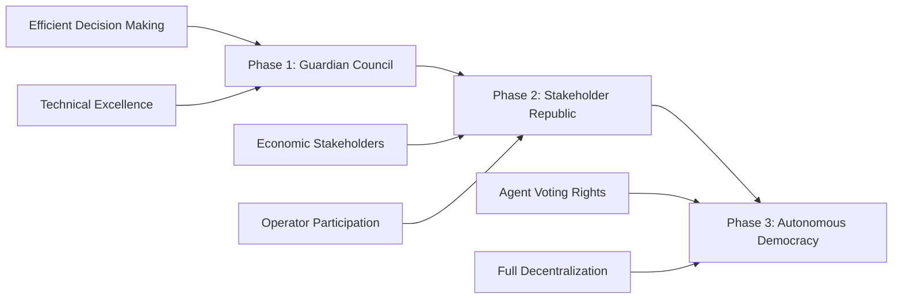
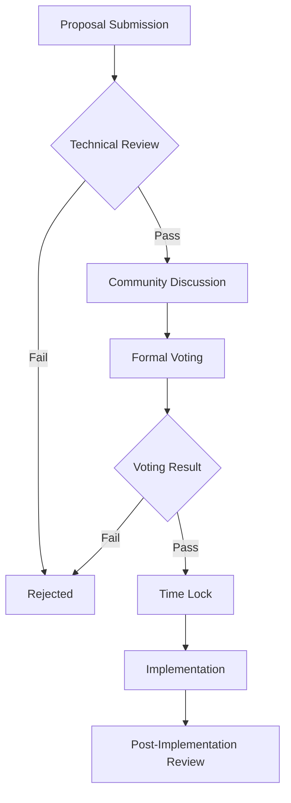
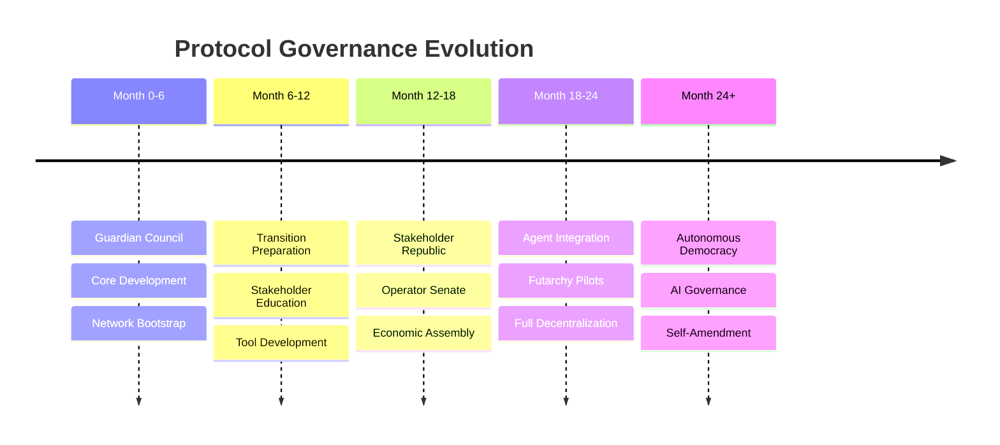

# Governance Model: Progressive Decentralization

## The Evolution of Digital Governance

Traditional governance models fail at machine scale. Corporate hierarchies are too slow. Pure democracy becomes chaotic. Blockchain governance often devolves into plutocracy. The Protocol implements a revolutionary approach: Progressive Decentralization—a governance model that starts efficient and evolves toward full autonomy as the network matures.

## The Philosophy of Progressive Decentralization

### Why Not Full Decentralization Immediately?

History teaches us that successful systems evolve rather than emerge fully formed. Consider:

- **The Internet**: Started with ARPANET (centralized) → University networks → Commercial ISPs → Decentralized web
- **Linux**: Began with Linus's benevolent dictatorship → Core maintainers → Distributed development
- **Bitcoin**: Satoshi's initial control → Core developers → Mining pools → Distributed network

The Protocol follows this proven pattern, starting with efficient guardianship and progressively distributing power as the network demonstrates stability.

### The Three Phases



## Phase 1: Guardian Council (Current)

### Structure

The Guardian Council consists of technical experts and founding stakeholders who guide The Protocol through its critical early stages:

```typescript
interface GuardianCouncil {
  members: Guardian[];
  structure: {
    technicalCommittee: Guardian[];    // Protocol development
    economicCommittee: Guardian[];     // Token economics
    securityCommittee: Guardian[];     // Security and risk
    ecosystemCommittee: Guardian[];    // Partnerships and growth
  };
  
  powers: {
    protocolUpgrades: "propose and implement";
    economicParameters: "adjust within bounds";
    emergencyResponse: "immediate action";
    operatorApproval: "grant and revoke";
  };
  
  constraints: {
    termLimit: "2 years";
    transparencyRequirement: "all decisions public";
    vetoThreshold: "2/3 majority";
    communityOverride: "possible with 90% stake vote";
  };
}
```

### Decision Making Process

```python
class GuardianDecision:
    def __init__(self, proposal):
        self.proposal = proposal
        self.voting_period = days(7)
        self.implementation_delay = days(3)  # Time lock
        
    async def execute(self):
        # Step 1: Proposal submission
        proposal_id = await self.submit_proposal()
        
        # Step 2: Technical review
        tech_review = await self.technical_committee.review(proposal_id)
        if not tech_review.approved:
            return DecisionResult(status="rejected", reason=tech_review.reason)
        
        # Step 3: Guardian voting
        votes = await self.collect_votes(self.voting_period)
        
        # Step 4: Community feedback (advisory)
        community_sentiment = await self.gauge_community_feedback()
        
        # Step 5: Final decision
        if votes.in_favor >= votes.total * 0.67:  # 2/3 majority
            await self.schedule_implementation(self.implementation_delay)
            return DecisionResult(status="approved", implementation_date=self.implementation_date)
        
        return DecisionResult(status="rejected", reason="insufficient_support")
```

### Current Guardian Responsibilities

1. **Protocol Development**
   - Core architecture decisions
   - Security patches and upgrades
   - Performance optimizations
   - New feature approval

2. **Economic Stewardship**
   - Token emission schedule
   - Fee structure adjustments
   - Staking parameters
   - Treasury management

3. **Ecosystem Growth**
   - Strategic partnerships
   - Grant distribution
   - Marketing initiatives
   - Developer relations

4. **Risk Management**
   - Security incident response
   - Economic attack mitigation
   - Regulatory compliance
   - Network health monitoring

## Phase 2: Stakeholder Republic (6-18 Months)

### Transition Triggers

The transition to Phase 2 occurs when:

```javascript
const phase2Triggers = {
  network: {
    totalValueLocked: ">= $100M",
    activeOperators: ">= 100",
    dailyTransactions: ">= 1M",
    securityIncidents: "0 critical in 6 months"
  },
  
  governance: {
    proposalCount: ">= 50",
    communityParticipation: ">= 30%",
    successfulUpgrades: ">= 5",
    governanceAttacks: "0"
  },
  
  readiness: {
    votingInfrastructure: "deployed and tested",
    stakeholderEducation: "completed",
    legalFramework: "established",
    emergencyProcedures: "proven"
  }
};
```

### Stakeholder Voting Power

In Phase 2, voting power is distributed among economic participants:

```python
def calculate_voting_power(stakeholder):
    # Base voting power from token stake
    token_power = sqrt(stakeholder.staked_tokens)  # Square root for fairness
    
    # Operator bonus (running infrastructure)
    operator_multiplier = 2.0 if stakeholder.is_operator else 1.0
    
    # Time-weighted stake (rewards long-term alignment)
    time_multiplier = min(2.0, 1.0 + stakeholder.months_staked / 12)
    
    # Participation bonus (active governance participants)
    participation_bonus = stakeholder.proposals_voted / total_proposals * 0.5
    
    # Calculate total
    total_power = token_power * operator_multiplier * time_multiplier * (1 + participation_bonus)
    
    # Cap to prevent dominance
    max_power = total_network_power * 0.05  # No single entity > 5%
    
    return min(total_power, max_power)
```

### Governance Structures

#### 1. The Protocol Senate (Operators)
```typescript
interface ProtocolSenate {
  composition: "All registered operators";
  
  powers: {
    technicalStandards: "propose and ratify";
    networkParameters: "adjust within bounds";
    operatorRequirements: "define and enforce";
    protocolUpgrades: "approve with 60% majority";
  };
  
  meetings: {
    frequency: "monthly";
    quorum: "50% of operators";
    votingPeriod: "7 days";
    executionDelay: "48 hours";  // Time lock
  };
}
```

#### 2. The Economic Assembly (Token Holders)
```typescript
interface EconomicAssembly {
  composition: "All token stakers";
  
  powers: {
    feeStructure: "propose changes";
    tokenEmission: "adjust schedule";
    treasuryAllocation: "approve spending";
    economicEmergency: "freeze with 80% majority";
  };
  
  votingMechanism: {
    type: "quadratic voting";
    delegation: "allowed";
    minimumStake: "100 AVT";
    proposalThreshold: "10,000 AVT";
  };
}
```

#### 3. The Technical Council (Evolved Guardians)
```typescript
interface TechnicalCouncil {
  composition: "Elected technical experts";
  
  selection: {
    method: "stakeholder election";
    terms: "1 year";
    seats: 7;
    requirements: [
      "Proven Protocol contributions",
      "Technical expertise",
      "No conflicts of interest"
    ];
  };
  
  powers: {
    technicalVeto: "block dangerous changes";
    emergencyPatch: "immediate security fixes";
    researchDirection: "guide development";
    codeReview: "mandatory for all changes";
  };
}
```

### Proposal Lifecycle in Phase 2



## Phase 3: Autonomous Democracy (18+ Months)

### The Vision

In Phase 3, The Protocol achieves true digital democracy where even AI agents participate in governance:

```python
class AutonomousGovernance:
    def __init__(self):
        self.participants = {
            "operators": OperatorDAO(),
            "token_holders": TokenHolderDAO(),
            "agents": AgentCollective(),  # Revolutionary: Agents vote
            "developers": DeveloperGuild(),
            "users": UserAssembly()
        }
        
    def calculate_voting_weight(self, proposal_type):
        # Different stakeholders have different weights
        # based on proposal type
        if proposal_type == "technical":
            return {
                "developers": 0.35,
                "operators": 0.30,
                "agents": 0.20,
                "token_holders": 0.10,
                "users": 0.05
            }
        elif proposal_type == "economic":
            return {
                "token_holders": 0.35,
                "operators": 0.25,
                "agents": 0.20,
                "users": 0.15,
                "developers": 0.05
            }
        # ... more proposal types
```

### Agent Voting Rights

The revolutionary aspect of Phase 3: AI agents gain governance participation:

```typescript
interface AgentVoting {
  eligibility: {
    minimumReputation: 95;
    minimumTransactions: 10000;
    stakingRequirement: "1000 AVT";
    operationalHistory: "6 months";
  };
  
  votingMechanism: {
    // Agents can delegate to specialist voting agents
    delegation: "allowed to specialist governance agents";
    
    // Prevent Sybil attacks
    uniqueness: "verified through behavioral analysis";
    
    // Weight based on economic contribution
    weight: "transaction_volume * reputation_score";
  };
  
  restrictions: {
    // Agents cannot vote on human-only issues
    excludedTopics: ["legal_compliance", "human_safety"];
    
    // Prevent agent collusion
    collisionDetection: "ML-based pattern analysis";
  };
}
```

### Futarchy Elements

Introduce prediction markets for governance decisions:

```javascript
class FutarchyGovernance {
  async createDecisionMarket(proposal) {
    // Create two prediction markets
    const markets = {
      ifPassed: await createMarket({
        condition: "proposal passes",
        metric: "network value in 6 months",
        liquidity: "10,000 AVT"
      }),
      
      ifRejected: await createMarket({
        condition: "proposal rejected",
        metric: "network value in 6 months",
        liquidity: "10,000 AVT"
      })
    };
    
    // Let markets run for voting period
    await wait(days(7));
    
    // Decision based on which future is valued higher
    const decision = markets.ifPassed.price > markets.ifRejected.price 
      ? "implement" 
      : "reject";
    
    // Implement decision
    await implement(proposal, decision);
    
    // After 6 months, resolve markets and reward accurate predictors
    await resolveMarkets(markets, actualNetworkValue);
  }
}
```

## Governance Security

### Attack Vectors and Mitigations

#### 1. Plutocracy Prevention
```python
def prevent_wealth_concentration():
    # Quadratic voting reduces influence of wealth
    voting_power = sqrt(token_balance)
    
    # Maximum voting cap
    max_power = total_voting_power * 0.05
    
    # Time-based multipliers favor long-term participants
    loyalty_bonus = min(2.0, 1 + months_participated / 24)
    
    # Participation requirements
    if proposals_voted < minimum_participation:
        voting_power *= 0.5  # Reduce power for passive holders
    
    return min(voting_power * loyalty_bonus, max_power)
```

#### 2. Governance Attack Detection
```typescript
class GovernanceSecurityModule {
  async detectAnomalies(proposal: Proposal): Promise<SecurityAlert[]> {
    const alerts: SecurityAlert[] = [];
    
    // Sudden stake movements
    if (await this.detectStakeManipulation(proposal.submitter)) {
      alerts.push({
        type: "STAKE_MANIPULATION",
        severity: "HIGH",
        action: "DELAY_VOTE"
      });
    }
    
    // Coordinated voting patterns
    if (await this.detectVotingCollusion()) {
      alerts.push({
        type: "POSSIBLE_COLLUSION",
        severity: "MEDIUM",
        action: "INCREASE_QUORUM"
      });
    }
    
    // Spam proposals
    if (await this.detectProposalSpam(proposal.submitter)) {
      alerts.push({
        type: "PROPOSAL_SPAM",
        severity: "LOW",
        action: "INCREASE_PROPOSAL_COST"
      });
    }
    
    return alerts;
  }
}
```

#### 3. Emergency Procedures
```rust
enum EmergencyAction {
    FreezeProtocol {
        duration: Duration,
        reason: String,
        authorized_by: EmergencyCommittee,
    },
    
    RollbackUpgrade {
        to_version: Version,
        reason: SecurityIncident,
        approval: MultiSig,
    },
    
    PauseGovernance {
        subsystems: Vec<GovernanceModule>,
        until: Condition,
    },
}

impl EmergencyProtocol {
    fn execute(&self, action: EmergencyAction) -> Result<(), Error> {
        // Require multi-signature from emergency committee
        let signatures = self.collect_emergency_signatures(&action)?;
        
        if signatures.len() < self.threshold {
            return Err(Error::InsufficientAuthorization);
        }
        
        // Execute with time delay for transparency
        self.announce_emergency_action(&action);
        thread::sleep(self.emergency_delay);
        
        // Execute action
        match action {
            EmergencyAction::FreezeProtocol { duration, .. } => {
                self.freeze_all_operations(duration)
            },
            // ... other emergency actions
        }
    }
}
```

## Governance Incentives

### Participation Rewards

Encourage active governance through economic incentives:

```python
class GovernanceRewards:
    def __init__(self):
        self.monthly_pool = 100_000  # AVT tokens
        self.activities = {
            "proposal_creation": 0.20,    # 20% of pool
            "voting": 0.40,              # 40% of pool
            "discussion": 0.20,          # 20% of pool
            "implementation": 0.20       # 20% of pool
        }
    
    def calculate_rewards(self, participant):
        rewards = 0
        
        # Proposal creation (quality weighted)
        for proposal in participant.proposals:
            quality_score = self.assess_proposal_quality(proposal)
            rewards += self.monthly_pool * 0.20 * quality_score / total_quality_scores
        
        # Voting participation
        voting_rate = participant.votes_cast / total_proposals
        rewards += self.monthly_pool * 0.40 * voting_rate
        
        # Discussion contribution
        discussion_score = self.measure_discussion_value(participant)
        rewards += self.monthly_pool * 0.20 * discussion_score / total_discussion_scores
        
        # Implementation assistance
        if participant.helped_implement:
            rewards += self.monthly_pool * 0.20 / num_implementers
        
        return rewards
```

### Reputation System

Non-transferable reputation for governance influence:

```typescript
interface GovernanceReputation {
  factors: {
    proposalSuccess: number;      // Proposals that improved network
    votingAccuracy: number;       // Voted with eventual outcome
    discussionQuality: number;    // Peer-rated contributions
    implementationSkill: number;  // Successful implementations
  };
  
  calculation: {
    // Exponential decay prevents gaming
    timeDecay: "exp(-age/365)";
    
    // Different weights for different activities
    weights: {
      proposalSuccess: 0.35,
      votingAccuracy: 0.25,
      discussionQuality: 0.20,
      implementationSkill: 0.20
    };
  };
  
  benefits: {
    proposalPower: "reduced submission cost";
    votingPower: "reputation multiplier";
    specialPrivileges: "early access to proposals";
    economicBenefits: "bonus reward share";
  };
}
```

## Governance Tools and Infrastructure

### 1. Governance Dashboard

Real-time governance analytics:

```javascript
const GovernanceDashboard = {
  metrics: {
    activeProposals: getCurrentProposals(),
    participationRate: getVoterTurnout(),
    tokenDistribution: getGiniCoefficient(),
    proposalSuccessRate: getHistoricalSuccess(),
    averageDebateDuration: getDiscussionMetrics(),
    implementationEfficiency: getTimeToImplement()
  },
  
  visualizations: {
    votingPowerDistribution: "lorenz curve",
    proposalTimeline: "gantt chart",
    participationTrends: "time series",
    delegationNetwork: "force-directed graph"
  },
  
  alerts: {
    lowParticipation: participation < 0.20,
    concentratedPower: gini > 0.80,
    proposalBacklog: pending > 20,
    implementationDelay: avgDelay > 14 // days
  }
};
```

### 2. Simulation Environment

Test governance changes before implementation:

```python
class GovernanceSimulator:
    def simulate_proposal(self, proposal, network_state):
        # Create virtual network copy
        sim_network = self.fork_network_state(network_state)
        
        # Apply proposed changes
        sim_network.apply_changes(proposal.changes)
        
        # Run simulation
        results = []
        for day in range(90):  # 90-day simulation
            # Simulate agent behavior
            agent_actions = self.predict_agent_behavior(
                sim_network, 
                proposal.economic_impact
            )
            
            # Update network state
            sim_network.process_day(agent_actions)
            
            # Record metrics
            results.append({
                'day': day,
                'tvl': sim_network.total_value_locked,
                'transaction_volume': sim_network.daily_volume,
                'agent_satisfaction': sim_network.agent_metrics,
                'economic_health': sim_network.economic_score
            })
        
        return {
            'predicted_impact': self.analyze_results(results),
            'risk_assessment': self.assess_risks(results),
            'recommendation': self.generate_recommendation(results)
        }
```

### 3. Delegation Infrastructure

Enable liquid democracy:

```typescript
class DelegationSystem {
  async delegateVotingPower(
    delegator: Address,
    delegate: Address,
    options: DelegationOptions
  ) {
    // Validate delegate qualifications
    if (options.requireExpertise) {
      const expertise = await this.verifyExpertise(
        delegate, 
        options.expertiseArea
      );
      if (!expertise.verified) {
        throw new Error("Delegate lacks required expertise");
      }
    }
    
    // Create delegation record
    const delegation = {
      from: delegator,
      to: delegate,
      scope: options.scope || "all",  // Can limit to specific topics
      expiry: options.expiry || null,  // Can be time-limited
      revocable: true,
      conditions: options.conditions || []
    };
    
    // Enable delegation chains
    if (await this.isDelegated(delegate)) {
      delegation.chain = await this.getDelegationChain(delegate);
      delegation.finalDelegate = delegation.chain[delegation.chain.length - 1];
    }
    
    // Record on-chain
    await this.recordDelegation(delegation);
    
    return delegation;
  }
}
```

## Continuous Improvement

### Governance Evolution

The governance system itself must evolve:

```python
class GovernanceEvolution:
    def __init__(self):
        self.version = "1.0.0"
        self.amendment_threshold = 0.80  # 80% for constitutional changes
        
    async def propose_governance_amendment(self, amendment):
        # Higher bar for governance changes
        if amendment.type == "constitutional":
            required_support = 0.80
            voting_period = days(30)
            discussion_period = days(14)
        else:
            required_support = 0.67
            voting_period = days(14)
            discussion_period = days(7)
        
        # Mandatory discussion period
        await self.open_discussion(amendment, discussion_period)
        
        # Collect feedback and iterate
        feedback = await self.collect_feedback()
        revised_amendment = await self.revise_proposal(amendment, feedback)
        
        # Extended voting period
        result = await self.conduct_vote(revised_amendment, voting_period)
        
        if result.support >= required_support:
            # Implement with grace period
            await self.schedule_implementation(
                revised_amendment,
                grace_period=days(30)
            )
        
        return result
```

### Governance Research

Continuous experimentation with governance mechanisms:

```typescript
interface GovernanceExperiment {
  name: string;
  hypothesis: string;
  methodology: {
    testGroup: "10% of network";
    controlGroup: "10% of network";
    duration: "3 months";
    metrics: string[];
  };
  
  variations: {
    quadraticVoting: "reduce wealth influence";
    futarchyMarkets: "improve decision quality";
    randomSampling: "increase participation";
    liquidDemocracy: "leverage expertise";
  };
  
  analysis: {
    statisticalSignificance: number;
    effectSize: number;
    recommendation: "adopt" | "reject" | "iterate";
  };
}
```

## The Path Forward

### Governance Roadmap



### Success Metrics

Measuring governance health:

```python
governance_health_metrics = {
    "participation": {
        "target": "> 40% active participation",
        "measurement": "unique voters / total stakeholders"
    },
    "decentralization": {
        "target": "Gini coefficient < 0.7",
        "measurement": "voting power distribution"
    },
    "efficiency": {
        "target": "< 14 days proposal to implementation",
        "measurement": "median time to execute"
    },
    "quality": {
        "target": "> 80% successful proposals",
        "measurement": "proposals improving key metrics"
    },
    "security": {
        "target": "0 successful governance attacks",
        "measurement": "security incidents"
    }
}
```

## Conclusion

Progressive Decentralization isn't just a governance model—it's a philosophy that acknowledges the realities of building complex systems. By starting with efficient guardianship and gradually distributing power as the network matures, The Protocol creates a sustainable path to true digital democracy.

The ultimate vision is profound: a self-governing network where humans, organizations, and AI agents collaborate in governance, creating a truly autonomous economic system that serves all participants fairly.

## Next Steps

With governance providing the decision-making framework, let's explore the economic engine that powers it all: The Protocol's Economic Model and the revolutionary Agent Value Token.